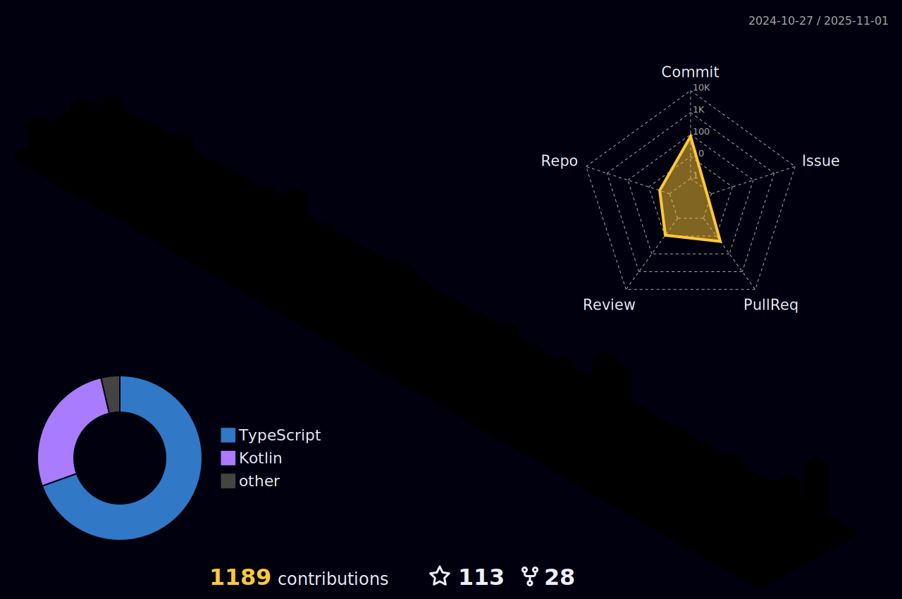

<h1 align="center">Hi 👋, I'm Nishara Senadheera AKA stoXmod</h1>
<h3 align="center">A passionate Full Stack Developer Based in Sri Lanka</h3>

  

- 👨‍💻 All of my projects are available at [https://nishara.me](https://nishara.me)

- 💬 Ask me about **React , Next and Node**

- 📫 You can reach me at **x@nishara.me**

<h3 align="left">Connect with me:</h3>

<h3 align="left">Languages and Tools:</h3>

                              

|  | 
&nbsp;
 |
| ------------- | ------------- |
